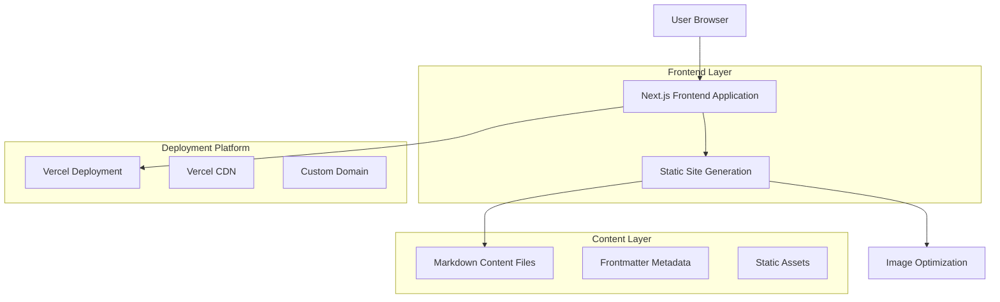

# Core Personal Blog Prototype - Technical Architecture Document

## 1. Architecture Design



## 2. Technology Description

- **Frontend**: Next.js\@15 + TypeScript + React\@18

- **Styling**: Tailwind CSS\@3 for responsive design

- **Content Management**: Markdown files with gray-matter for frontmatter parsing

- **Build Tool**: Next.js built-in bundler with Turbopack

- **Deployment**: Vercel with automatic deployments from Git

- **Image Processing**: Next.js Image component with automatic optimization

- **Syntax Highlighting**: Prism.js for code blocks in blog posts

## 3. Route Definitions

| Route         | Purpose                                      |
| ------------- | -------------------------------------------- |
| /             | Home page with hero section and recent posts |
| /blog         | Blog listing page with all published posts   |
| /blog/\[slug] | Individual blog post detail page             |
| /about        | About page with personal introduction        |
| /404          | Custom 404 error page                        |

## 4. Project Structure

```
personal-blog/
├── app/
│   ├── layout.tsx          # Root layout component
│   ├── page.tsx            # Home page
│   ├── blog/
│   │   ├── page.tsx        # Blog listing page
│   │   └── [slug]/
│   │       └── page.tsx    # Blog post detail page
│   ├── about/
│   │   └── page.tsx        # About page
│   └── globals.css         # Global styles
├── components/
│   ├── Header.tsx          # Navigation header
│   ├── Footer.tsx          # Site footer
│   ├── PostCard.tsx        # Blog post preview card
│   └── PostContent.tsx     # Blog post content renderer
├── content/
│   ├── posts/              # Markdown blog posts
│   └── pages/              # Static page content
├── lib/
│   ├── posts.ts            # Post fetching utilities
│   └── markdown.ts         # Markdown processing
├── public/
│   ├── images/             # Static images
│   └── favicon.ico         # Site favicon
├── tailwind.config.js      # Tailwind configuration
├── next.config.js          # Next.js configuration
└── package.json            # Dependencies
```

## 5. Data Model

### 5.1 Blog Post Structure

```typescript
interface BlogPost {
  slug: string;
  title: string;
  excerpt: string;
  content: string;
  publishedAt: string;
  updatedAt?: string;
  category: string;
  tags: string[];
  featuredImage?: string;
  readingTime: number;
}
```

### 5.2 Frontmatter Schema

```yaml
---
title: 'Getting Started with Next.js 15'
excerpt: 'Learn the basics of Next.js 15 and its new features'
publishedAt: '2024-01-15'
category: 'tutorial'
tags: ['nextjs', 'react', 'web-development']
featuredImage: '/images/blog/nextjs-15-guide.jpg'
---
```

## 6. Core Functions

### 6.1 Content Processing

```typescript
// lib/posts.ts
import fs from 'fs';
import path from 'path';
import matter from 'gray-matter';

const postsDirectory = path.join(process.cwd(), 'content/posts');

export function getAllPosts(): BlogPost[] {
  const fileNames = fs.readdirSync(postsDirectory);
  const allPostsData = fileNames.map(fileName => {
    const slug = fileName.replace(/\.md$/, '');
    const fullPath = path.join(postsDirectory, fileName);
    const fileContents = fs.readFileSync(fullPath, 'utf8');
    const { data, content } = matter(fileContents);

    return {
      slug,
      content,
      ...data,
    } as BlogPost;
  });

  return allPostsData.sort(
    (a, b) =>
      new Date(b.publishedAt).getTime() - new Date(a.publishedAt).getTime()
  );
}

export function getPostBySlug(slug: string): BlogPost | null {
  try {
    const fullPath = path.join(postsDirectory, `${slug}.md`);
    const fileContents = fs.readFileSync(fullPath, 'utf8');
    const { data, content } = matter(fileContents);

    return {
      slug,
      content,
      ...data,
    } as BlogPost;
  } catch {
    return null;
  }
}
```

### 6.2 Markdown Processing

```typescript
// lib/markdown.ts
import { remark } from 'remark';
import html from 'remark-html';
import prism from 'remark-prism';

export async function markdownToHtml(markdown: string): Promise<string> {
  const result = await remark()
    .use(prism)
    .use(html, { sanitize: false })
    .process(markdown);

  return result.toString();
}
```

## 7. Component Architecture

### 7.1 Layout Components

```typescript
// components/Header.tsx
export default function Header() {
  return (
    <header className="bg-white shadow-sm">
      <nav className="max-w-4xl mx-auto px-4 py-6">
        <div className="flex justify-between items-center">
          <Link href="/" className="text-xl font-bold">
            Your Name
          </Link>
          <div className="space-x-6">
            <Link href="/">Home</Link>
            <Link href="/blog">Blog</Link>
            <Link href="/about">About</Link>
          </div>
        </div>
      </nav>
    </header>
  );
}
```

### 7.2 Content Components

```typescript
// components/PostCard.tsx
interface PostCardProps {
  post: BlogPost;
}

export default function PostCard({ post }: PostCardProps) {
  return (
    <article className="bg-white rounded-lg shadow-sm p-6">
      <h2 className="text-xl font-semibold mb-2">
        <Link href={`/blog/${post.slug}`}>
          {post.title}
        </Link>
      </h2>
      <p className="text-gray-600 mb-4">{post.excerpt}</p>
      <div className="flex justify-between items-center text-sm text-gray-500">
        <time>{new Date(post.publishedAt).toLocaleDateString()}</time>
        <span>{post.readingTime} min read</span>
      </div>
    </article>
  );
}
```

## 8. Deployment Configuration

### 8.1 Next.js Configuration

```javascript
// next.config.js
/** @type {import('next').NextConfig} */
const nextConfig = {
  output: 'export',
  trailingSlash: true,
  images: {
    unoptimized: true,
  },
  experimental: {
    turbo: {
      rules: {
        '*.md': ['raw-loader'],
      },
    },
  },
};

module.exports = nextConfig;
```

### 8.2 Package Dependencies

```json
{
  "dependencies": {
    "next": "^15.0.0",
    "react": "^18.0.0",
    "react-dom": "^18.0.0",
    "typescript": "^5.0.0",
    "gray-matter": "^4.0.3",
    "remark": "^15.0.0",
    "remark-html": "^16.0.0",
    "remark-prism": "^1.3.6"
  },
  "devDependencies": {
    "@types/node": "^20.0.0",
    "@types/react": "^18.0.0",
    "@types/react-dom": "^18.0.0",
    "tailwindcss": "^3.4.0",
    "autoprefixer": "^10.4.0",
    "postcss": "^8.4.0"
  }
}
```

## 9. Development Workflow

### 9.1 Content Creation

1. Create new `.md` file in `content/posts/` directory
2. Add frontmatter with required metadata
3. Write content in Markdown format
4. Build and deploy automatically via Vercel

### 9.2 Build Process

1. Next.js processes Markdown files at build time
2. Static pages generated for all blog posts
3. Optimized assets and images
4. Deploy to Vercel with automatic
