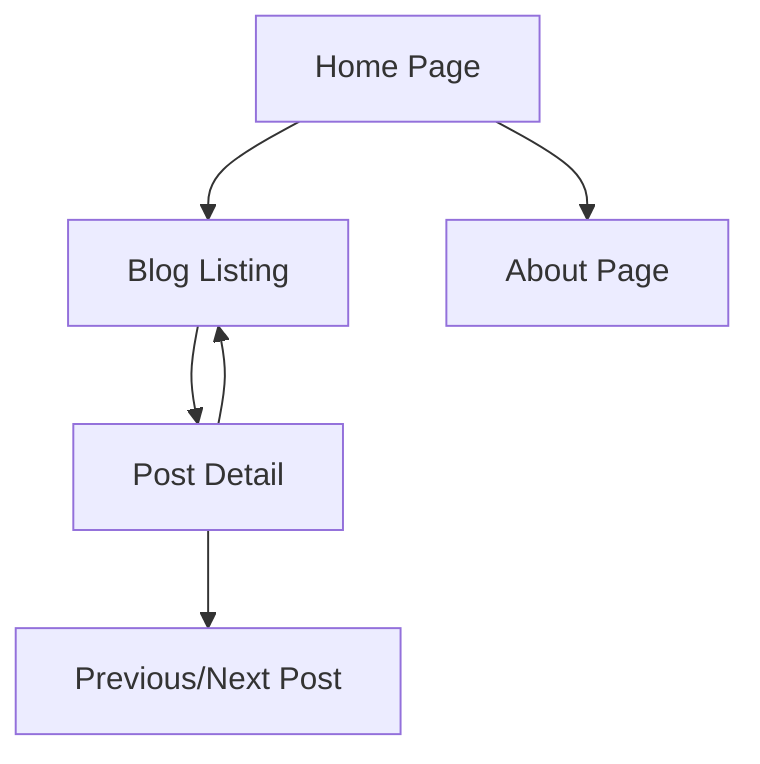

# Core Personal Blog Prototype - Product Requirements Document

## 1. Product Overview

A minimal viable personal blog prototype focused on content publishing and reading experience. This core version establishes the foundation for a technology blog with essential features for content creation, display, and navigation.

* **Primary Purpose**: Create a functional blog prototype with content management and responsive design for iterative development.

* **Target Outcome**: Establish core blog functionality that can be extended with advanced features in future iterations.

## 2. Core Features

### 2.1 Feature Module

Our core blog prototype consists of the following essential pages:

1. **Home page**: hero section, navigation menu, recent blog posts preview
2. **Blog page**: complete blog posts listing with pagination
3. **Post detail page**: individual blog post display with markdown rendering
4. **About page**: personal introduction and professional background

### 2.2 Page Details

| Page Name        | Module Name           | Feature description                                                              |
| ---------------- | --------------------- | -------------------------------------------------------------------------------- |
| Home page        | Hero section          | Display personal branding, tagline, and introduction with call-to-action         |
| Home page        | Navigation menu       | Provide clean navigation between Home, Blog, and About sections                  |
| Home page        | Recent posts          | Show 3-4 latest blog posts with titles, excerpts, and read more links            |
| Blog page        | Post listing          | Display all published blog posts with titles, dates, excerpts, and pagination    |
| Blog page        | Post metadata         | Show publication date, reading time, and category for each post                  |
| Post detail page | Content display       | Render full markdown content with proper typography and code syntax highlighting |
| Post detail page | Post navigation       | Provide previous/next post navigation and back to blog link                      |
| About page       | Personal introduction | Display professional background, skills overview, and contact information        |
| About page       | Professional photo    | Include professional headshot with consistent branding                           |

## 3. Core Process

**Content Flow:**
Visitors land on the homepage and can immediately see recent blog posts. They can navigate to the full blog listing or read individual posts. The about page provides context about the author and their expertise.

**Content Management Flow:**
Blog posts are created as Markdown files with frontmatter metadata. Content is statically generated at build time for optimal performance.

## 4. User Interface Design

### 4.1 Design Style

* **Primary Colors**: Professional blue (#2563eb) and dark gray (#1f2937)

* **Secondary Colors**: Light gray (#f8fafc) for backgrounds, subtle accent colors

* **Typography**: Inter font for headings, system fonts for body text, 16px base size

* **Layout Style**: Clean, minimal design with card-based post previews

* **Button Style**: Rounded corners with hover effects for navigation elements

### 4.2 Page Design Overview

| Page Name        | Module Name     | UI Elements                                                               |
| ---------------- | --------------- | ------------------------------------------------------------------------- |
| Home page        | Hero section    | Large typography, professional introduction, gradient or solid background |
| Home page        | Recent posts    | Card layout with post titles, excerpts, and publication dates             |
| Blog page        | Post listing    | Clean list layout with consistent spacing and typography hierarchy        |
| Post detail page | Content area    | Typography-focused layout with proper line spacing and code highlighting  |
| About page       | Profile section | Professional photo with text content in readable columns                  |

### 4.3 Responsiveness

Mobile-first responsive design optimized for all device sizes. Navigation collapses to hamburger menu on mobile devices. Typography and spacing adjust appropriately for different screen sizes.

## 5. Content Requirements

### 5.1 Blog Post Structure

* Markdown files with YAML frontmatter for metadata

* Support for code syntax highlighting

* Image embedding with proper optimization

* Publication date and category classification

### 5.2 Content Organization

* Posts organized chronologically with newest first

* Simple category system for content classification

* Clean URL structure with post slugs

## 6. Technical Constraints

### 6.1 Performance Goals

* Fast loading times with static site generation

* Optimized images and assets

* Minimal JavaScript for core functionality

### 6.2 SEO Requirements

* Proper meta tags for all pages

* Structured data for blog posts

* Clean, semantic HTML structure

* Optimized page titles and descriptions

