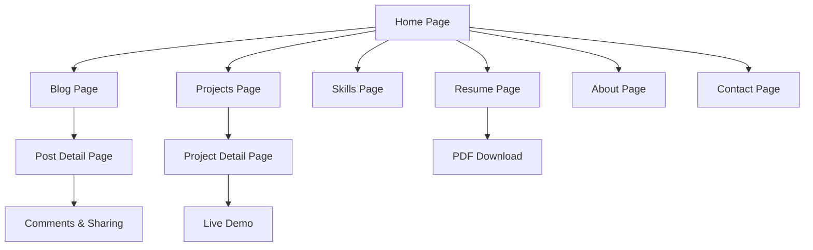

# Personal Technology Blog & Portfolio Website - Product Requirements Document

## 1. Product Overview

A comprehensive personal technology blog and portfolio website that serves as both a professional showcase and an interactive platform for sharing technology insights. The platform enables visitor engagement without mandatory registration while establishing a professional online presence for career development.

* **Primary Purpose**: Create a personal blog focused on technology news, trends, and commentary while showcasing projects, skills, and professional resume.

* **Target Market**: Technology professionals, potential employers, industry peers, and technology enthusiasts seeking insights and professional networking.

## 2. Core Features

### 2.1 Feature Module

Our personal technology blog and portfolio requirements consist of the following main pages:

1. **Home page**: hero section, featured posts, navigation menu, recent blog highlights
2. **Blog page**: technology posts list, search functionality, tag filtering, post categories
3. **Projects page**: interactive project showcase, live demos, code repositories, case studies
4. **Skills page**: interactive skills visualization, technology proficiencies, certifications timeline
5. **Resume page**: interactive resume display, downloadable PDF, professional timeline, contact links
6. **About page**: personal introduction, professional background, career journey, headshot
7. **Contact page**: contact form, social media links, professional inquiries
8. **Post detail page**: individual blog post, comments section, social sharing, related posts
9. **Project detail page**: project case study, technical documentation, implementation notes, live demo

### 2.2 Page Details

| Page Name           | Module Name              | Feature description                                                          |
| ------------------- | ------------------------ | ---------------------------------------------------------------------------- |
| Home page           | Hero section             | Display professional branding, tagline, and call-to-action for main sections |
| Home page           | Featured posts           | Showcase 3-4 highlighted blog posts with thumbnails and excerpts             |
| Home page           | Navigation menu          | Provide easy access to all main sections with responsive design              |
| Blog page           | Post listing             | Display technology posts with pagination, thumbnails, and metadata           |
| Blog page           | Search functionality     | Enable full-text search across all blog posts and content                    |
| Blog page           | Tag filtering            | Filter posts by technology tags and categories for easy navigation           |
| Projects page       | Project showcase         | Display project cards with thumbnails, descriptions, and technology stacks   |
| Projects page       | Live demos               | Provide interactive demos and links to deployed applications                 |
| Projects page       | Code repositories        | Link to GitHub repositories with technical documentation                     |
| Skills page         | Skills visualization     | Interactive display of technical proficiencies with experience levels        |
| Skills page         | Certifications           | Timeline of professional certifications and achievements                     |
| Skills page         | Technology matrix        | Organized display of programming languages, frameworks, and tools            |
| Resume page         | Interactive resume       | Web-optimized professional experience and education display                  |
| Resume page         | PDF download             | Generate and download professional PDF version of resume                     |
| Resume page         | Professional timeline    | Visual timeline of career progression and key milestones                     |
| About page          | Personal introduction    | Professional background, career journey, and motivations                     |
| About page          | Professional branding    | High-quality headshot and consistent personal branding                       |
| Contact page        | Contact form             | Secure form with validation for professional inquiries                       |
| Contact page        | Social media integration | Links to professional social media profiles and platforms                    |
| Post detail page    | Blog content             | Display full blog post with markdown rendering and code syntax highlighting  |
| Post detail page    | Comments system          | Enable commenting without mandatory registration using custom display names  |
| Post detail page    | Social sharing           | Share posts on social media platforms for broader reach                      |
| Post detail page    | Like/reaction system     | Allow visitors to like and react to content with simple interactions         |
| Project detail page | Case study               | Detailed project analysis with problem-solving approaches                    |
| Project detail page | Technical documentation  | Implementation notes, architecture decisions, and lessons learned            |

## 3. Core Process

**Visitor Flow:**
Visitors land on the homepage and can immediately access featured content. They can browse blog posts, explore projects, view skills and resume, or contact directly. No registration is required for reading, commenting, or engaging with content. Visitors can set custom display names for comments and interactions.

**Content Management Flow:**
Content is managed through Markdown files with frontmatter for metadata. Blog posts can be created, edited, and published with draft and scheduling capabilities. Images are optimized automatically, and content is categorized with tags for easy organization.

**Engagement Flow:**
Visitors can comment on posts without creating accounts, like/react to content, and share posts on social media. Comment moderation tools ensure content quality while maintaining open engagement.

## 4. User Interface Design

### 4.1 Design Style

* **Primary Colors**: Professional blue (#2563eb) and dark gray (#1f2937) for technology aesthetic

* **Secondary Colors**: Light gray (#f8fafc) for backgrounds, green (#10b981) for accents

* **Button Style**: Rounded corners with subtle shadows, hover animations for interactivity

* **Typography**: Inter font family for headings, system fonts for body text, 16px base size

* **Layout Style**: Card-based design with clean grid layouts, top navigation with mobile hamburger menu

* **Icons**: Lucide React icons for consistency, technology-specific icons for skills section

### 4.2 Page Design Overview

| Page Name        | Module Name          | UI Elements                                                                          |
| ---------------- | -------------------- | ------------------------------------------------------------------------------------ |
| Home page        | Hero section         | Large typography, professional headshot, gradient background, call-to-action buttons |
| Home page        | Featured posts       | Card layout with hover effects, thumbnail images, excerpt text, read more buttons    |
| Blog page        | Post listing         | Grid layout, search bar with filters, pagination controls, tag badges                |
| Projects page    | Project showcase     | Masonry grid layout, project thumbnails, technology stack badges, demo buttons       |
| Skills page      | Skills visualization | Progress bars, interactive charts, certification badges, timeline components         |
| Resume page      | Interactive resume   | Timeline layout, expandable sections, download button, contact information           |
| Post detail page | Content display      | Typography-focused layout, code syntax highlighting, social sharing buttons          |
| Post detail page | Comments section     | Threaded comments, custom name input, like buttons, moderation indicators            |

### 4.3 Responsiveness

The website is mobile-first with responsive design optimized for all device sizes. Touch interactions are optimized for mobile devices, with swipe gestures for image galleries and touch-friendly button sizes. Desktop versions utilize hover states and larger content areas for enhanced user experience.

## 5. Technical Requirements

### 5.1 Performance Requirements

* Page load time under 3 seconds on average connection

* Mobile optimization with perfect responsive design

* SEO score of 90+ on Google PageSpeed Insights

* Image optimization for faster loading times

* Efficient caching strategies for improved performance

### 5.2 Security & Functionality

* HTTPS enforcement with automatic SSL certificates

* Comment spam protection without blocking legitimate users

* Secure contact forms with proper validation

* Social media integration for cross-platform sharing

* Search functionality across blog posts and projects

### 5.3 Content Management

* Markdown-based content with frontmatter metadata

* Draft and scheduled publishing capabilities

* Content categorization with tags and categories

* Image upload and optimization for blog posts

* Code syntax highlighting for technical content

