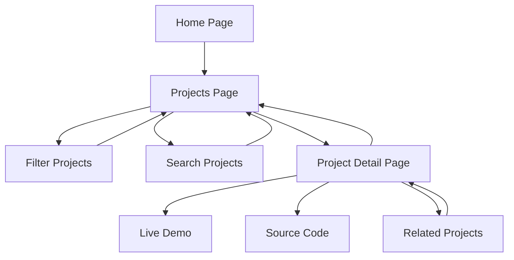

# Projects Feature - Product Requirements Document

## 1. Product Overview

Add a "Projects" tab to the personal blog navigation to showcase completed projects, technical achievements, and portfolio items. This feature will provide visitors with a comprehensive view of the developer's practical work and technical capabilities, complementing the existing Blog and About sections.

The Projects section will serve as a portfolio showcase, helping potential employers, collaborators, and fellow developers understand the breadth and depth of technical expertise through real-world project examples.

## 2. Core Features

### 2.1 User Roles

No role distinction is necessary for this feature. All visitors will have read-only access to view project information.

### 2.2 Feature Module

Our Projects feature consists of the following main pages:

1. **Projects List Page**: Project grid/list view, filtering by technology/category, search functionality, featured projects section.
2. **Project Detail Page**: Detailed project information, technical specifications, live demo links, source code links, image gallery, technology stack details.

### 2.3 Page Details

| Page Name | Module Name | Feature description |
|-----------|-------------|---------------------|
| Projects List | Navigation Integration | Add Projects tab to header navigation with consistent styling and active state management |
| Projects List | Hero Section | Display introductory text about projects and technical expertise |
| Projects List | Project Grid | Display projects in responsive card layout with thumbnail, title, brief description, and tech stack tags |
| Projects List | Filtering System | Filter projects by technology, category, or project type with dynamic tag-based filtering |
| Projects List | Search Functionality | Search projects by name, description, or technology stack |
| Projects List | Featured Projects | Highlight 2-3 most important projects at the top of the page |
| Project Detail | Project Header | Display project title, brief description, live demo and source code links |
| Project Detail | Technical Details | Show comprehensive technical specifications, architecture, and implementation details |
| Project Detail | Image Gallery | Display project screenshots, diagrams, and visual documentation |
| Project Detail | Technology Stack | List all technologies, frameworks, and tools used with version information |
| Project Detail | Project Timeline | Show development timeline and key milestones |
| Project Detail | Related Projects | Suggest similar or related projects for continued browsing |

## 3. Core Process

### Main User Flow

1. User clicks "Projects" in the main navigation
2. User lands on Projects list page with overview of all projects
3. User can filter projects by technology or category
4. User can search for specific projects
5. User clicks on a project card to view detailed information
6. User can navigate to live demo or source code from project detail page
7. User can browse related projects or return to projects list

## 4. User Interface Design

### 4.1 Design Style

- **Primary Colors**: Blue (#2563eb) and Purple (#7c3aed) gradients matching existing theme
- **Secondary Colors**: Muted backgrounds (#f8fafc) and card backgrounds (#ffffff)
- **Button Style**: Rounded corners (8px), consistent with existing navigation buttons
- **Font**: System font stack matching existing typography (Inter/system-ui)
- **Layout Style**: Card-based design with consistent spacing, responsive grid layout
- **Icons**: Lucide React icons for consistency with existing components
- **Animations**: Subtle hover effects and transitions (300ms duration)

### 4.2 Page Design Overview

| Page Name | Module Name | UI Elements |
|-----------|-------------|-------------|
| Projects List | Navigation | Projects tab with active state styling, consistent with Home/Blog/About tabs |
| Projects List | Hero Section | Gradient background, centered text, call-to-action button matching home page style |
| Projects List | Filter Bar | Horizontal tag-based filters with active/inactive states, search input field |
| Projects List | Project Cards | Card layout with image, title, description, tech stack tags, hover animations |
| Projects List | Featured Section | Larger cards for featured projects with "Featured" badge |
| Project Detail | Header | Large title, subtitle, action buttons (Demo/Code) with external link icons |
| Project Detail | Content Sections | Tabbed or sectioned layout for different information types |
| Project Detail | Image Gallery | Responsive image grid with lightbox functionality |
| Project Detail | Tech Stack | Colored badges/tags for each technology with consistent styling |

### 4.3 Responsiveness

Desktop-first approach with mobile-adaptive design:
- Desktop: 3-column project grid
- Tablet: 2-column project grid
- Mobile: Single-column layout with stacked cards
- Touch-optimized buttons and navigation elements
- Responsive typography scaling
- Mobile-friendly image galleries and modals