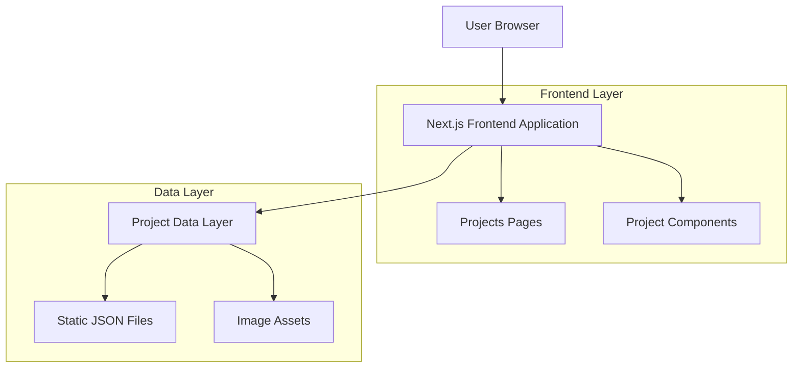
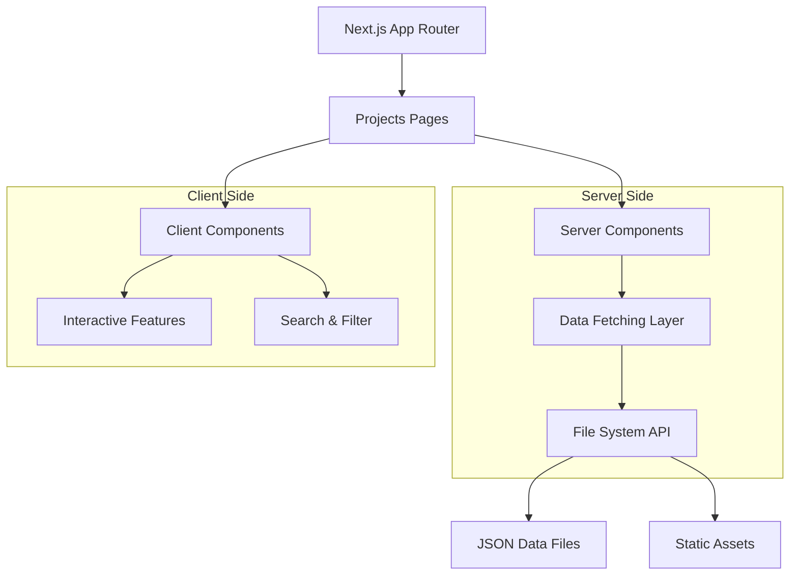
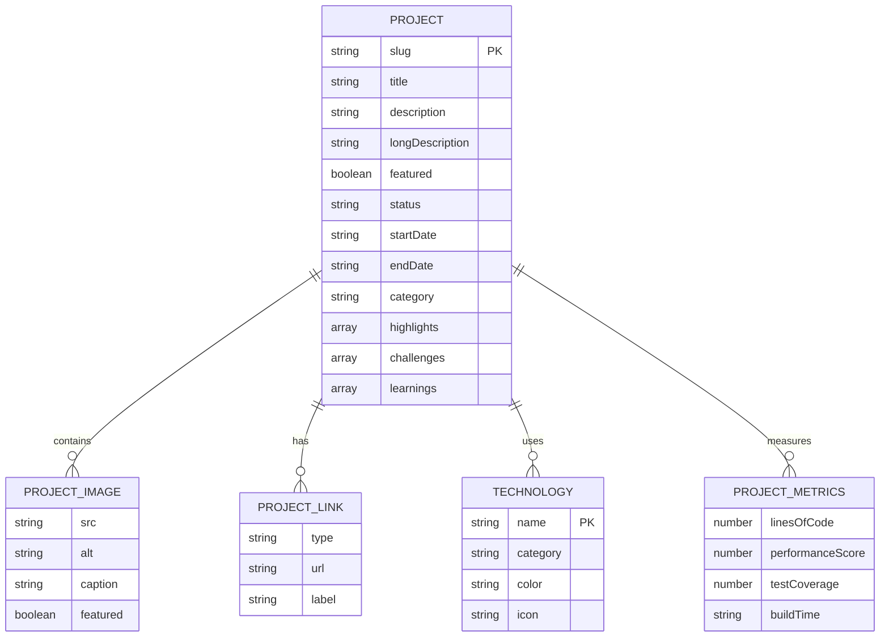

# Projects Feature - Technical Architecture Document

## 1. Architecture Design



## 2. Technology Description

- Frontend: React@18 + Next.js@14 + TypeScript + Tailwind CSS
- Data Management: Static JSON files + Next.js file system
- Image Handling: Next.js Image optimization
- Icons: Lucide React (consistent with existing codebase)
- Styling: Tailwind CSS + CSS custom properties for theming

## 3. Route Definitions

| Route | Purpose |
|-------|----------|
| /projects | Projects list page with filtering and search functionality |
| /projects/[slug] | Individual project detail page with comprehensive information |

## 4. API Definitions

### 4.1 Data Structure Types

```typescript
// Project data types
export interface Project {
  slug: string;
  title: string;
  description: string;
  longDescription: string;
  featured: boolean;
  status: 'completed' | 'in-progress' | 'archived';
  startDate: string;
  endDate?: string;
  category: string;
  technologies: Technology[];
  links: ProjectLink[];
  images: ProjectImage[];
  highlights: string[];
  challenges: string[];
  learnings: string[];
  metrics?: ProjectMetrics;
}

export interface Technology {
  name: string;
  category: 'frontend' | 'backend' | 'database' | 'devops' | 'tool' | 'language';
  color: string;
  icon?: string;
}

export interface ProjectLink {
  type: 'demo' | 'source' | 'documentation' | 'article';
  url: string;
  label: string;
}

export interface ProjectImage {
  src: string;
  alt: string;
  caption?: string;
  featured?: boolean;
}

export interface ProjectMetrics {
  linesOfCode?: number;
  performanceScore?: number;
  testCoverage?: number;
  buildTime?: string;
}

// Filter and search types
export interface ProjectFilters {
  category?: string;
  technology?: string;
  status?: string;
  featured?: boolean;
}

export interface ProjectSearchParams {
  query?: string;
  filters: ProjectFilters;
  sortBy: 'date' | 'title' | 'featured';
  sortOrder: 'asc' | 'desc';
}
```

### 4.2 Data Management Functions

```typescript
// lib/projects.ts functions
export async function getAllProjects(): Promise<Project[]>
export async function getProjectBySlug(slug: string): Promise<Project | null>
export async function getFeaturedProjects(): Promise<Project[]>
export async function getProjectsByCategory(category: string): Promise<Project[]>
export async function getProjectsByTechnology(tech: string): Promise<Project[]>
export async function searchProjects(query: string): Promise<Project[]>
export async function getAllTechnologies(): Promise<Technology[]>
export async function getAllCategories(): Promise<string[]>
```

## 5. Server Architecture Diagram



## 6. Data Model

### 6.1 Data Model Definition



### 6.2 Data Definition Language

**Project Data Structure (JSON)**

```json
// data/projects/project-slug.json
{
  "slug": "personal-blog",
  "title": "Personal Tech Blog",
  "description": "A modern, responsive blog built with Next.js and TypeScript",
  "longDescription": "A comprehensive personal blog platform featuring...",
  "featured": true,
  "status": "completed",
  "startDate": "2024-01-15",
  "endDate": "2024-03-20",
  "category": "Web Development",
  "technologies": [
    {
      "name": "Next.js",
      "category": "frontend",
      "color": "#000000",
      "icon": "nextjs"
    },
    {
      "name": "TypeScript",
      "category": "language",
      "color": "#3178c6",
      "icon": "typescript"
    },
    {
      "name": "Tailwind CSS",
      "category": "frontend",
      "color": "#06b6d4",
      "icon": "tailwindcss"
    }
  ],
  "links": [
    {
      "type": "demo",
      "url": "https://blog.example.com",
      "label": "Live Demo"
    },
    {
      "type": "source",
      "url": "https://github.com/username/blog",
      "label": "Source Code"
    }
  ],
  "images": [
    {
      "src": "/images/projects/blog/homepage.jpg",
      "alt": "Blog homepage screenshot",
      "caption": "Homepage with hero section and recent posts",
      "featured": true
    },
    {
      "src": "/images/projects/blog/blog-page.jpg",
      "alt": "Blog listing page",
      "caption": "Blog posts with filtering and search"
    }
  ],
  "highlights": [
    "Server-side rendering with Next.js App Router",
    "Responsive design with Tailwind CSS",
    "TypeScript for type safety",
    "SEO optimization with metadata API",
    "Dark mode support"
  ],
  "challenges": [
    "Implementing efficient markdown processing",
    "Optimizing image loading and performance",
    "Creating a flexible theming system"
  ],
  "learnings": [
    "Advanced Next.js App Router patterns",
    "Performance optimization techniques",
    "Accessibility best practices"
  ],
  "metrics": {
    "linesOfCode": 15000,
    "performanceScore": 95,
    "testCoverage": 85,
    "buildTime": "45s"
  }
}
```

**Directory Structure**

```
src/
├── app/
│   └── projects/
│       ├── page.tsx                 # Projects list page
│       ├── [slug]/
│       │   ├── page.tsx            # Project detail page
│       │   └── not-found.tsx       # Project not found page
│       └── loading.tsx             # Loading UI
├── components/
│   └── projects/
│       ├── ProjectCard.tsx         # Project card component
│       ├── ProjectGrid.tsx         # Projects grid layout
│       ├── ProjectFilters.tsx      # Filter and search UI
│       ├── ProjectDetail.tsx       # Project detail layout
│       ├── TechnologyBadge.tsx     # Technology tag component
│       ├── ProjectGallery.tsx      # Image gallery component
│       └── ProjectMetrics.tsx      # Metrics display component
├── lib/
│   └── projects.ts                 # Project data fetching functions
├── types/
│   └── projects.ts                 # Project type definitions
data/
└── projects/
    ├── project-1.json
    ├── project-2.json
    └── ...
public/
└── images/
    └── projects/
        ├── project-1/
        │   ├── thumbnail.jpg
        │   ├── screenshot-1.jpg
        │   └── ...
        └── project-2/
            └── ...
```