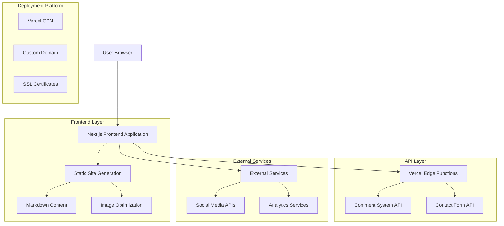
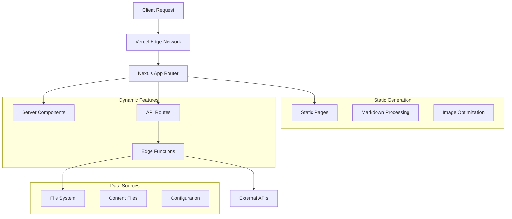
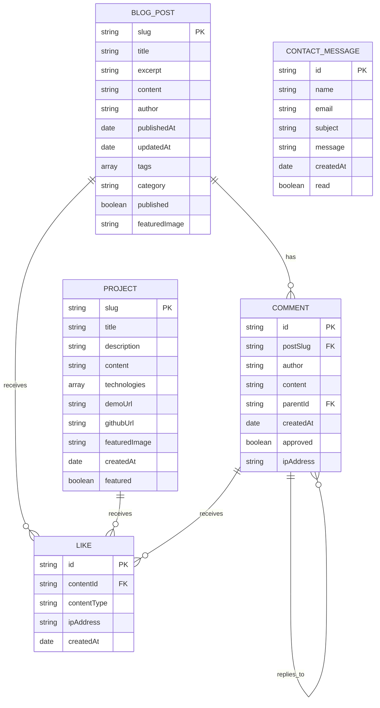

# Personal Technology Blog & Portfolio Website - Technical Architecture Document

## 1. Architecture Design



## 2. Technology Description

- **Frontend**: Next.js@15 + TypeScript + Tailwind CSS@3 + React@18
- **Content Management**: Markdown with gray-matter for frontmatter parsing
- **Styling**: Tailwind CSS with custom design system
- **Deployment**: Vercel with automatic deployments
- **APIs**: Vercel Edge Functions for serverless functionality
- **Image Processing**: Next.js Image Optimization
- **Icons**: Lucide React for consistent iconography
- **Syntax Highlighting**: Prism.js or Shiki for code blocks

## 3. Route Definitions

| Route | Purpose |
|-------|---------|
| / | Home page with hero section and featured content |
| /blog | Blog listing page with search and filtering |
| /blog/[slug] | Individual blog post detail page |
| /projects | Project portfolio showcase page |
| /projects/[slug] | Individual project detail page |
| /skills | Skills and expertise visualization page |
| /resume | Interactive resume with PDF download |
| /about | Personal introduction and background |
| /contact | Contact form and professional inquiries |
| /api/comments | API endpoint for comment system |
| /api/contact | API endpoint for contact form submission |
| /api/likes | API endpoint for like/reaction functionality |

## 4. API Definitions

### 4.1 Core API

**Comment System**
```
POST /api/comments
```

Request:
| Param Name | Param Type | isRequired | Description |
|------------|------------|------------|-------------|
| postSlug | string | true | The slug of the blog post |
| author | string | true | Custom display name (no registration required) |
| content | string | true | Comment content |
| parentId | string | false | Parent comment ID for threaded comments |

Response:
| Param Name | Param Type | Description |
|------------|------------|-------------|
| success | boolean | Status of comment submission |
| commentId | string | Unique identifier for the comment |
| timestamp | string | Comment creation timestamp |

Example:
```json
{
  "postSlug": "next-js-performance-tips",
  "author": "TechEnthusiast",
  "content": "Great insights on Next.js optimization!"
}
```

**Like/Reaction System**
```
POST /api/likes
```

Request:
| Param Name | Param Type | isRequired | Description |
|------------|------------|------------|-------------|
| contentId | string | true | ID of content being liked (post or comment) |
| contentType | string | true | Type of content ('post' or 'comment') |
| action | string | true | Action type ('like' or 'unlike') |

Response:
| Param Name | Param Type | Description |
|------------|------------|-------------|
| success | boolean | Status of like action |
| likeCount | number | Updated like count |

**Contact Form**
```
POST /api/contact
```

Request:
| Param Name | Param Type | isRequired | Description |
|------------|------------|------------|-------------|
| name | string | true | Sender's name |
| email | string | true | Sender's email address |
| subject | string | true | Message subject |
| message | string | true | Message content |

Response:
| Param Name | Param Type | Description |
|------------|------------|-------------|
| success | boolean | Status of message submission |
| messageId | string | Unique identifier for the message |

## 5. Server Architecture Diagram



## 6. Data Model

### 6.1 Data Model Definition



### 6.2 Data Definition Language

**Blog Post Frontmatter Structure**
```yaml
---
title: "Advanced Next.js Performance Optimization Techniques"
excerpt: "Learn how to optimize your Next.js applications for maximum performance"
author: "Your Name"
publishedAt: "2024-01-15"
updatedAt: "2024-01-16"
tags: ["nextjs", "performance", "optimization", "react"]
category: "tutorial"
published: true
featuredImage: "/images/blog/nextjs-performance.jpg"
seo:
  title: "Next.js Performance Optimization Guide"
  description: "Complete guide to optimizing Next.js applications"
  keywords: ["nextjs", "performance", "web development"]
---
```

**Project Frontmatter Structure**
```yaml
---
title: "E-commerce Platform"
description: "Full-stack e-commerce solution with modern technologies"
technologies: ["Next.js", "TypeScript", "Prisma", "PostgreSQL"]
demoUrl: "https://demo.example.com"
githubUrl: "https://github.com/username/project"
featuredImage: "/images/projects/ecommerce-platform.jpg"
createdAt: "2024-01-01"
featured: true
status: "completed"
---
```

**Comment Storage (JSON)**
```json
{
  "id": "comment_123",
  "postSlug": "nextjs-performance-tips",
  "author": "TechEnthusiast",
  "content": "Great article! Very helpful tips.",
  "parentId": null,
  "createdAt": "2024-01-15T10:30:00Z",
  "approved": true,
  "ipAddress": "192.168.1.1"
}
```

**Skills Data Structure**
```json
{
  "categories": [
    {
      "name": "Frontend Development",
      "skills": [
        {
          "name": "React",
          "level": 90,
          "yearsOfExperience": 5,
          "projects": 15
        },
        {
          "name": "TypeScript",
          "level": 85,
          "yearsOfExperience": 3,
          "projects": 12
        }
      ]
    }
  ],
  "certifications": [
    {
      "name": "AWS Certified Developer",
      "issuer": "Amazon Web Services",
      "date": "2023-06-15",
      "credentialUrl": "https://aws.amazon.com/verification"
    }
  ]
}
```

## 7. Deployment Configuration

**Vercel Configuration (vercel.json)**
```json
{
  "framework": "nextjs",
  "buildCommand": "npm run build",
  "outputDirectory": ".next",
  "installCommand": "npm install",
  "functions": {
    "app/api/**/*.ts": {
      "runtime": "edge"
    }
  },
  "headers": [
    {
      "source": "/(.*)",
      "headers": [
        {
          "key": "X-Content-Type-Options",
          "value": "nosniff"
        },
        {
          "key": "X-Frame-Options",
          "value": "DENY"
        }
      ]
    }
  ]
}
```

**Environment Variables**
```env
NEXT_PUBLIC_SITE_URL=https://yourdomain.com
NEXT_PUBLIC_SITE_NAME="Your Name - Technology Blog"
CONTACT_EMAIL=your.email@domain.com
SMTP_HOST=smtp.gmail.com
SMTP_PORT=587
SMTP_USER=your.email@gmail.com
SMTP_PASS=your_app_password
ANALYTICS_ID=G-XXXXXXXXXX
```